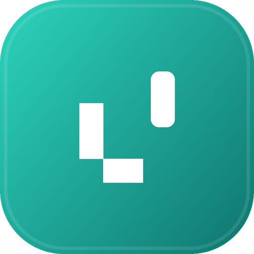

<div align="center">

  

  <h1>LocalDock — النسخة العربية</h1>
  <p><strong>حوّل أي حاسوب إلى سحابة شخصية خاصة داخل شبكتك المحلية</strong><br/>
  Turn Any Computer into a Private Personal Cloud for Your Local Network</p>

[](https://github.com/Youssef-Alaa-Hamdy/LocalDock/releases)
[](https://tauri.app/)
[-black?logo=next.js&logoColor=white)](https://nextjs.org/)
[](#-التعريب-العالمي)
[](#-الثيمات)
[](https://github.com/Youssef-Alaa-Hamdy/LocalDock)
[](LICENSE)

[🇬🇧 English — Full Version](README.md) • [العربية](#-نظرة-عامة) • [أحدث التحسينات](#-أحدث-التحسينات) • [المميزات](#-أبرز-المميزات) • [محرك النقل](#-محرك-النقل) • [الأمان](#-الأمان-والخصوصية) • [Releases](https://github.com/Youssef-Alaa-Hamdy/LocalDock/releases)

---

</div>

## 🌟 نظرة عامة

**LocalDock** يجعل التخزين والربط عبر الشبكة المحلية في غاية السهولة والأناقة. حوّل حاسوبك الشخصي إلى سيرفر سحابي خاص فائق السرعة لجميع أجهزتك (الهاتف، التابلت، الحواسيب الأخرى) داخل شبكتك المحلية (Wi-Fi).

بخلاف الخدمات السحابية التقليدية (Google Drive، Dropbox) أو أنظمة NAS المعقدة، **LocalDock يعمل مباشرة على المجلدات الحقيقية على جهازك** (في أي قرص مثل `C:\` أو `D:\`) — بدون اشتراكات، بدون إنترنت، بدون تتبّع، وبأعلى سرعة ممكنة لشبكتك المنزلية. والتجربة كاملة **مُعرّبة بالكامل مع دعم RTL** إلى جانب **10 لغات عالمية** و**4 حزم ثيمات** بوضعَي فاتح وداكن — فتشعر كل أجهزة شبكتك أن التطبيق صُمم خصيصاً لها.

```text
اختر مجلداً حقيقياً على الحاسوب (مثال: D:\Projects)
                   ↓
        حدّد الصلاحيات (قراءة / كتابة)
                   ↓
امسح رمز QR بالهاتف → متاح فوراً على كامل الشبكة!
```

---

## 🆕 أحدث التحسينات

مرّ المشروع بسلسلة كاملة من جولات التحسين الاحترافية. إليك ما أضافته كل جولة:

| الجولة | أبرز ما أُنجز |
| :--- | :--- |
| **v1 — أساسات الشبكة الذكية** | روابط المشاركة ورموز QR تُبنى تلقائياً على **عنوان الـ IP المحلي الحقيقي** (تقييم ذكي للعناوين الخاصة)، مراقبة حية للمجلدات، bottom sheets للجوال. |
| **v2 — تجربة الوسائط** | معاينات داخلية لـ**الصور / الفيديو / الصوت / PDF**، مصغّرات مولّدة من الخادم، وشاشة نقل حية عبر الأجهزة. |
| **v3 — المصغّرات والصقل** | بدائل مصغّرات من جهة العميل تضمن ظهورها دائماً، مع تحسينات كثافة الواجهة. |
| **v4 — الرفع من الجهاز نفسه** | رفع مجلدات كاملة **من هاتفك أو حاسوبك مباشرة** (منتقي مجلدات أصلي في المتصفح)، كشف الأجهزة المرافقة، وتدعيم محرك النقل. |
| **v5 — العربية والثيمات** | **تعريب كامل مع دعم RTL**، أساس i18n آمن الأنواع (Type-safe)، ونظام **ثيمات** متكامل. |
| **v6 — واجهة عالمية بعشر لغات** | إضافة **الإسبانية · الفرنسية · الألمانية · البرتغالية · الروسية · الصينية · الهندية · اليابانية** — كل شاشة ونافذة وإشعار ورسالة خطأ مترجمة بالكامل. |
| **v6.1 — إعادة بناء تخطيط الجوال** | **درج جانبي منسدل** يحل محل الشريط السفلي؛ إزالة أي تجاوز أفقي على كل الشاشات. |
| **v6.2 — شبكة بلا إعدادات** | LocalDock **يسجّل قواعد جدار حماية ويندوز تلقائياً** عند تشغيل السيرفر — بلا أي خطوات يدوية. |
| **v6.3 — تعزيز المصادقة** | توحيد تصريح الأجهزة المرافقة على مسارات النظام والمشاركات والأجهزة والنشاط — بلا فجوات صلاحيات. |

---

## ✨ أبرز المميزات

| الميزة | الوصف |
| :--- | :--- |
| 📁 **مشاركة مجلدات حقيقية** | شارك أي مجلد فعلي على أي قرص (`C:\`، `D:\` وغيرهما) بلا مجلدات وهمية أو بيئات معزولة مصطنعة. |
| 🔒 **محلي 100% وبلا إنترنت** | بياناتك تبقى داخل شبكتك المحلية حصراً؛ يعمل التطبيق كاملاً دون اتصال إنترنت فعّال. |
| 📱 **اقتران فوري عبر QR** | اقرن أي هاتف أو تابلت في ثوانٍ عبر رمز QR ديناميكي بأكواد أحادية الاستخدام تنتهي بعد 5 دقائق. |
| 🌍 **واجهة بعشر لغات + RTL** | كل شاشة ونافذة وإشعار ورسالة خطأ مترجمة في 10 لغات؛ والعربية بانعكاس كامل للاتجاه (RTL). |
| 🎨 **حزم ثيمات × فاتح/داكن** | 4 حزم ألوان احترافية (Teal، Ocean، Amethyst، Sunset) وكل توليفة فاتح/داكن مصقولة بعناية. |
| 🚀 **رفع متقطع قابل للاستئناف** | تشانكات 4 ميجابايت تُرفع **بثلاث اتصالات متوازية** للملف الواحد، مع تحقق SHA-256، وإيقاف/استئناف، وإعادة محاولة تلقائية — حتى إعادة تحميل الصفحة لا تفقد قائمة الانتظار. |
| ⚡ **تحميل متوازٍ بنمط IDM** | الملفات الكبيرة تُحمَّل عبر **حتى 4 اتصالات HTTP-Range متوازية** وتُكتب مباشرة إلى القرص على هيئة بث. |
| 📊 **نشاط نقل حي بين الأجهزة** | كل جهاز متصل يرى **من ينقل ماذا الآن** — نسبة تقدم وسرعة ووقت متبقٍ لحظياً. |
| 🖼️ **معاينات وسائط احترافية** | عارض صور بتكبير وتدوير واختصارات لوحة مفاتيح، مشغّلات فيديو وصوت، وقارئ PDF داخل التطبيق — مع مصغّرات مخزّنة مؤقتاً. |
| 📂 **رفع مجلدات من الجهاز نفسه** | اختر مجلداً كاملاً **من هاتفك أو حاسوبك** عبر منتقي المتصفح الأصلي، مع فلترة تلقائية لملفات النظام العشوائية. |
| 📱 **تخطيط محمول متكيف** | درج جانبي منسدل وشريط علوي مدمج وbottom sheets — **صفر تجاوز أفقي** على أي حجم شاشة. |
| 🌐 **استضافة مواقع ثابتة** | استضف مواقع HTML/CSS/JS من أي مجلد تحت `localdock.local/sites/{slug}` مباشرة. |
| 🔗 **روابط شبكة ذكية** | روابط المشاركة ورموز QR تُبنى تلقائياً على العنوان المحلي المُثبت أنه يعمل على شبكتك. |
| 🖥️ **تطبيق مكتبي متكامل لويندوز** | تطبيق Tauri v2 أصلي: شريط مهام (Tray)، بدء تلقائي مع النظام، اكتشاف mDNS، و**قواعد جدار حماية تلقائية**. |

---

## 🌍 التعريب العالمي

يأتي LocalDock بتجربة **مُعرّبة بالكامل في 10 لغات**. لا شيء يُترك بدون ترجمة — لوحات التحكم، النوافذ، الإشعارات، معالج الإعداد، رسائل الأخطاء، وحتى رسائل محرك النقل:

| الرمز | اللغة | الاسم الأصلي | الاتجاه |
| :--- | :--- | :--- | :---: |
| 🇬🇧 `en` | الإنجليزية | English | LTR |
| 🇸🇦 `ar` | العربية | **العربية** | **RTL** |
| 🇪🇸 `es` | الإسبانية | Español | LTR |
| 🇫🇷 `fr` | الفرنسية | Français | LTR |
| 🇩🇪 `de` | الألمانية | Deutsch | LTR |
| 🇧🇷 `pt` | البرتغالية (البرازيل) | Português | LTR |
| 🇷🇺 `ru` | الروسية | Русский | LTR |
| 🇨🇳 `zh` | الصينية المبسطة | 简体中文 | LTR |
| 🇮🇳 `hi` | الهندية | हिन्दी | LTR |
| 🇯🇵 `ja` | اليابانية | 日本語 | LTR |

**كيف يعمل النظام — هندسة تضمن الجودة:**

* **تغطية 100% مُفروضة من المُصرّف.** كل قاموس يجب أن يطابق شكل القاموس الإنجليزي تماماً (`SameShape<typeof en>`) — المترجم TypeScript يرفض البناء لو نقص مفتاح واحد. لن ترى أبداً واجهة نصف مترجمة.
* **أسماء اللغات بأبجديتها الأصلية.** مبدّل اللغة يعرض كل لغة كما يكتبها متحدثوها (العربية، Español، 日本語…).
* **كشف ذكي للغة.** في أول زيارة تتبع الواجهة لغة المتصفح؛ وبعدها يملك التفضيل المحفوظ (في `localStorage`) الكلمة الأخيرة.
* **RTL حقيقي وليس مجرد قلب.** العربية تحوّل `<html dir="rtl">` والبنية كاملة مبنية على خصائص CSS المنطقية، فتنعكس الهوامش والحدود والأدراج والأيقونات طبيعياً.
* **إضافة لغة جديدة = ملفان فقط:** أنشئ `src/lib/localdock/i18n/<code>.ts` موسوماً بنوع القاموس الإنجليزي، ثم سجّله في `locales.ts` — المبدّل والاتجاه والخطوط والتنسيقات تتبنّاه تلقائياً.

---

## 🎨 الثيمات

إلى جانب أوضاع **الفاتح / الداكن / حسب النظام** الكلاسيكية، يقدّم LocalDock **4 حزم ثيمات احترافية** — وكل توليفة منها مواطن من الدرجة الأولى بمجموعات متغيرات CSS مضبوطة بالكامل:

| الحزمة | تدرّج اللون المميز | الطابع |
| :--- | :--- | :--- |
| 🟢 **Teal** *(الافتراضية)* | `#0F766E` → `#14B8A6` → `#99F6E4` | الهوية الهادئة والمركّزة الأصلية لـ LocalDock |
| 🔵 **Ocean** | `#1D4ED8` → `#3B82F6` → `#BFDBFE` | أزرق عميق إنتاجي |
| 🟣 **Amethyst** | `#7E22CE` → `#A855F7` → `#E9D5FF` | طاقة بنفسجية إبداعية |
| 🟠 **Sunset** | `#B45309` → `#F59E0B` → `#FDE68A` | دفء كهرماني مريح |

تعيش هوية الحزمة على `<html data-theme="…">` بجوار صنف `.dark` من next-themes، ويُحفظ الاختيار في `localStorage`، بل ويبقى **لون واجهة المتصفح** (`<meta name="theme-color">`) متزامناً مع توليفة الحزمة × الوضع.

---

## 🖼️ تجربة الوسائط

* **معاينات احترافية داخل التطبيق.** الصور تُفتح في عارض كامل بتكبير وتدوير واختصارات لوحة مفاتيح (`+` / `-` / `0` / `R`)؛ الفيديو والصوت في مشغّلات مخصصة؛ وPDF يُعرض داخلياً — لا حاجة لتنزيل ملف لمجرد *مشاهدته*.
* **مصغّرات من الخادم.** الصور تُصغَّر عبر **sharp** (واعٍ لبيانات EXIF، ومخرجات WebP)؛ والفيديوهات تلتقط إطاراً واحداً عبر **ffmpeg** عند توفره، مع بدائل تلقائية من جهة العميل في غير ذلك.
* **تخزين مؤقت عنيف.** ذاكرة LRU داخلية إضافة إلى قرص تخزين مؤقت لكل تثبيت (`~/.thumbs/`، مفاتيحه: المسار + وقت التعديل + الحجم + الحجم الهدف) — فلا يُعاد ترميز الملف نفسه مهما تكررت المشاهدات وتعددت الأجهزة.
* **مصادقة لا تعطل عناصر الوسائط.** وسوم ``/`<video>` لا ترسل ترويسات مصادقة، لذا تُصادق المشاركات الخاصة وسائطها عبر رموز قصيرة العمر مخصصة للمشاركة (صلاحية منزلقة 15 دقيقة تُجدد قبل انتهائها) — المعاينات تعمل في كل مكان دون إضعاف الأمان.
* **بث HTTP Range.** فيديو 4K وصوت وملفات PDF ضخمة تُبث بتقديم وتأخير سلس داخل المتصفح مباشرة.

---

## ⚡ محرك النقل

محرك واحد من جهة العميل (مبني على zustand) يدير كل بايت يتحرك:

| | خط الأنابيب |
| :--- | :--- |
| **⬆️ الرفع** | بدء جلسة → **3 رفع متوازٍ لتشانكات 4 ميجابايت** لكل ملف → إنهاء موثّق بـ SHA-256. حتى ملفين بالتزامن، إعادة محاولة تلقائية (×4 بتراجع أُسّي مقيّد)، والجلسات تُطابق الخادم — أعد تحميل الصفحة واستأنف من حيث توقفت («الاستئناف من 6.2 جيجابايت»). |
| **⬇️ التحميل** | **بنمط IDM: حتى 4 اتصالات HTTP-Range متوازية** لكل ملف. مع File System Access API يُكتب البث مباشرة إلى القرص الحقيقي (مع إيقاف/استئناف)، وبديل Blob يغطي بقية المتصفحات. قائمة الانتظار وحالة الاستئناف تنجوان من إعادة التحميل عبر IndexedDB. |
| **📊 النشاط الحي** | كل رفع وتحميل يُبلَّغ عنه إلى ناقل (Bus) من جهة الخادم في الذاكرة — **كل جهاز مفتوح يرى الصورة الحية ذاتها**: من ينقل ماذا، وبأي نسبة وسرعة ووقت متبقٍ. الإدخالات اليتيمة تُنظَّف تلقائياً (صمّام نبض 20 ثانية). |

---

## 📱 تجاوب كامل بلا تنازلات

* **سطح المكتب (شاشات كبيرة):** شريط جانبي ثابت بعرض 240 بكسل يبقي التنقل وحالة الأجهزة على بعد نظرة واحدة.
* **التابلت والهاتف:** يتحول الشريط إلى **درج منسدل** (285–320 بكسل، بحد أقصى 85% من العرض) يُفتح من شريط علوي مدمج — مع شريط حالة داخل الدرج.
* **صفر تجاوز أفقي** على أي عرض شاشة؛ النوافذ المنبثقة تتكيف مع وحدات `dvh`؛ وbottom sheets تتولى أفعال الجوال.
* مكون **تكبير حجم الأيقونات** في متصفح الملفات (إيقافات جاهزة بنمط مستكشف ويندوز + شريط تمرير) يكيّف كثافة الشبكة من معارض المصغّرات إلى القوائم الكثيفة.

---

## 📊 مقارنة مع البدائل

| الميزة | **LocalDock** | **Google Drive / Dropbox** | **Syncthing** | **AirDrop** |
| :--- | :---: | :---: | :---: | :---: |
| **مكان التخزين** | مجلدات محلية حقيقية | خوادم شركات بعيدة | مجلدات مكررة متزامنة | نقل عابر |
| **يتطلب إنترنت** | ❌ لا (LAN فقط) | ✅ نعم (إجباري) | ❌ لا | ❌ لا |
| **حد السرعة** | ⚡ كامل سرعة الشبكة | 🐌 مقيد برفع مزود الخدمة | ⚡ كامل سرعة الشبكة | ⚡ Wi-Fi Direct |
| **حسابات / تسجيل** | ❌ لا شيء | ✅ مطلوب | ❌ لا شيء | ❌ لا شيء |
| **لغات الواجهة** | ✅ **10 مدمجة + RTL** | ✅ كثيرة (سحابية) | ⚠️ بجهود المجتمع | ❌ مرتبط بالنظام |
| **نظام ثيمات** | ✅ 4 حزم × فاتح/داكن | ⚠️ أساسي | ❌ لا شيء | ❌ مرتبط بالنظام |
| **نقل متقطع + متوازٍ** | ✅ تشانكات متعددة الاتصالات | ✅ نعم | ✅ نعم | ❌ الكل أو لا شيء |
| **عرض حي للنقل بين الأجهزة** | ✅ مدمج | ⚠️ تقدم الرفع فقط | ⚠️ واجهة تقنية | ❌ لا |
| **عبر المنصات (أندرويد/iOS/كمبيوتر)** | ✅ نعم (ويب + تطبيقات) | ✅ نعم | ⚠️ معقد على iOS | ❌ أبل فقط |
| **استضافة مواقع ثابتة** | ✅ نعم مدمجة | ❌ لا | ❌ لا | ❌ لا |
| **بلا إعداد / واجهة فورية** | ✅ معالج 60 ثانية | ⚠️ يتطلب تسجيل دخول | ⚠️ واجهة تقنية | ✅ سلس |

---

## 🏗️ المعمارية التقنية

```text
 ┌─────────────────────────────────────────────────────────────┐
 │                    الشبكة المحلية (LAN / Wi-Fi)              │
 └──────────────┬───────────────────────────────┬──────────────┘
                │                               │
       ┌────────▼────────┐             ┌────────▼────────┐
       │   هاتف / تابلت  │             │ حواسيب أخرى     │
       │  (ويب / PWA)    │             │  (ويب / PWA)    │
       │  10 لغات · RTL  │             │  10 لغات · RTL  │
       │  · 4 ثيمات      │             │  · 4 ثيمات      │
       └────────▲────────┘             └────────▲────────┘
                │                               │
                └───────────────┬───────────────┘
                                │ HTTP / REST / mDNS
 ┌──────────────────────────────▼──────────────────────────────┐
 │                  الجهاز المضيف لـ LocalDock                  │
 │                                                             │
 │   ┌─────────────────────────────────────────────────────┐   │
 │   │               قشرة Tauri v2 المكتبية                │   │
 │   │  • شريط المهارات والمحرك الخلفي المصغّر              │   │
 │   │  • نوافذ اختيار مجلدات ويندوز الأصلية               │   │
 │   │  • مذيع mDNS ‏(localdock.local)                       │   │
 │   │  • بدء تلقائي مع ويندوز (السجل)                      │   │
 │   │  • قواعد جدار حماية تلقائية (netsh)                  │   │
 │   └──────────────────────────┬──────────────────────────┘   │
 │                              │ جسر Loopback                 │
 │   ┌──────────────────────────▼──────────────────────────┐   │
 │   │           خادم Next.js 16 ‏(Standalone)               │   │
 │   │  • محرك رفع بالتشانكات (4MB بتوثيق SHA-256)          │   │
 │   │  • بث HTTP Range ‏(206، اتصالات متوازية)              │   │
 │   │  • خدمة المصغّرات ‏(sharp + ffmpeg اختياري)            │   │
 │   │  • ناقل نشاط النقل الحي (بين الأجهزة)                │   │
 │   │  • مخزن أكواد الاقتران ‏(صلاحية 5 دقائق، مرة واحدة)   │   │
 │   │  • رموز الوسائط ‏(صلاحية منزلقة 15 دقيقة)             │   │
 │   │  • استضافة المواقع الثابتة ‏(/sites/{slug})           │   │
 │   └──────────────────────────┬──────────────────────────┘   │
 │                              │ إدخال/إخراج نظام ملفات حقيقي  │
 │   ┌──────────────────────────▼──────────────────────────┐   │
 │   │     أقراصك ومجلداتك الحقيقية ‏(C:\‏، ‏D:\‏ وغيرهما)      │   │
 │   └─────────────────────────────────────────────────────┘   │
 └─────────────────────────────────────────────────────────────┘
```

---

## 🚀 البدء السريع

### 1. نزّل تطبيق ويندوز (موصى به)
احصل على أحدث إصدار من [صفحة Releases](https://github.com/Youssef-Alaa-Hamdy/LocalDock/releases):
* **المثبِّت:** `LocalDock_1.0.0_x64-setup.exe` (موصى به)
* **النسخة المحمولة:** `LocalDock-portable.zip` (بلا تثبيت)

وتُبنى نسخ ويندوز تلقائياً في CI مع كل وسم إصدار.

### 2. التشغيل من المصدر (للمطورين)

تأكد من تثبيت [Bun](https://bun.sh) ‏(أو Node.js 20+):

```bash
# استنسخ المستودع
git clone https://github.com/Youssef-Alaa-Hamdy/LocalDock.git
cd LocalDock

# ثبّت الاعتماديات
bun install

# شغّل خادم التطوير
bun run dev
```

افتح `http://localhost:3000` في متصفحك — معالج الإعداد الأولي سيأخذك بيدك خلال 60 ثانية!

### 3. بناء ملف ويندوز التنفيذي والمثبِّت

```bash
# بناء تطبيق الويب الإنتاجي + حزمة Tauri ‏(NSIS)
bun run build:windows
```

يُولَّد المثبِّت في المسار:
`src-tauri/target/release/bundle/nsis/LocalDock_1.0.0_x64-setup.exe`

---

## 📱 ربط الهواتف والأجهزة

1. افتح LocalDock على حاسوبك المضيف.
2. انتقل إلى **الأجهزة** → اضغط **إضافة جهاز** ‏(أو من معالج الإعداد).
3. سيُعرض رمز QR يحوي رمز اقتران آمناً أحادي الاستخدام صالحاً لمدة 5 دقائق.
4. امسح الرمز بكاميرا هاتفك:
   - يفتح هاتفك LocalDock في المتصفح فوراً.
   - يُمنح رمز جهاز مشفَّراً يُحفظ في التخزين المحلي.
   - ويمكنك الآن التصفح والرفع والتحميل والبث مباشرة من هاتفك!

---

## 🛡️ الأمان والخصوصية

LocalDock مبني بنموذج أمني صارم **«الآمن افتراضياً»**:

* **حصر صارم بالشبكة المحلية:** الخادم لا يقبل إلا الترافيك من نطاقات IPv4/IPv6 الخاصة (`10.0.0.0/8`، `172.16.0.0/12`، `192.168.0.0/16`، `127.0.0.1`).
* **مصادقة المالك:** إعدادات الخادم وإنشاء المشاركات وإبطال الأجهزة محمية بمفتاح `X-LocalDock-Owner` يُولَّد عند أول تشغيل.
* **تصريح الأجهزة المرافقة:** الأجهزة المقترنة مُصرَّح لها باستمرار عبر مسارات النظام والمشاركات والأجهزة والنشاط — بلا فجوات صلاحيات بين وحدة المالك والمرافقين.
* **أكواد اقتران أحادية الاستخدام:** تنتهي تلقائياً بعد 5 دقائق وتُستهلك عند أول مطالبة.
* **رموز وسائط قصيرة العمر:** عناصر الوسائط في المشاركات الخاصة تُصادق برموز مخصصة بصلاحية منزلقة 15 دقيقة — معاينات منتهية الصلاحية دون كشف بيانات الاعتماد.
* **حماية من Path Traversal:** تعقيم مطلق للمسارات وفحوص حدود تمنع الوصول العشوائي للملفات خارج المشاركات المصرح بها.
* **صلاحيات لكل مشاركة:** كل مشاركة قابلة للضبط كـ**قراءة فقط** أو **قراءة وكتابة**، مع وصول ضيوف اختياري.
* **جدار الحماية مُعتنى به عنك:** على ويندوز يسجّل LocalDock قواعد السماح الواردة الخاصة به (المنفذ + بيئة تشغيل الخادم) عند البدء — شبكة صحيحة بلا أي إعداد يدوي.

---

## 📚 الوثائق

تتوفر وثائق أعمق في مجلد [`docs/`](docs/) (مكتوبة بالعربية):

| الوثيقة | الوصف |
| :--- | :--- |
| [`docs/USER_GUIDE.md`](docs/USER_GUIDE.md) | دليل المستخدم بلغة الحياة اليومية — من أول 60 ثانية حتى الإتقان |
| [`docs/ARCHITECTURE.md`](docs/ARCHITECTURE.md) | المعمارية التقنية الكاملة والمبدأ الحاكم وراء كل قرار |
| [`docs/SECURITY.md`](docs/SECURITY.md) | نموذج الأمان: Safe by Default، الاقتران، والصلاحيات |
| [`docs/WINDOWS_APP.md`](docs/WINDOWS_APP.md) | تفاصيل غلاف Tauri v2 وتشغيل السيرفر كعملية خلفية |

---

## 🛠️ التقنيات المستخدمة

* **الواجهة الأمامية:** [Next.js 16](https://nextjs.org/) ‏(App Router، Turbopack)، [React 19](https://react.dev/)، [Tailwind CSS](https://tailwindcss.com/)، [Radix UI](https://www.radix-ui.com/)، [Lucide Icons](https://lucide.dev/)
* **الحالة والنقل:** محرك نقل مبني على [zustand](https://zustand.docs.pmnd.rs/)، File System Access API، حفظ عبر IndexedDB
* **محرك التعريب:** نظام i18n مخصص آمن الأنواع (قواميس مفروضة الشكل عبر المُصرّف `SameShape`)، RTL عبر خصائص CSS المنطقية — بلا اعتماديات زمن تشغيل
* **الثيمات:** [next-themes](https://github.com/pacocoursey/next-themes) ‏(فاتح/داكن/النظام) + حزم متغيرات `data-theme`
* **خط الوسائط:** [sharp](https://sharp.pixelplumbing.com/) ‏(مصغّرات الصور)، [ffmpeg](https://ffmpeg.org/) اختياري (صور الفيديو)
* **القشرة المكتبية:** [Tauri v2](https://tauri.app/) ‏(Rust إصدار 2021)
* **الشبكة المحلية:** mDNS / DNS-SD ‏(`mdns-sd`)، WebSocket / استقصاء Server-Sent
* **بيئة التشغيل:** [Node.js 22 LTS](https://nodejs.org/) و[Bun](https://bun.sh/)
* **الحزم و CI:** ‏NSIS x64، ‏GitHub Actions ‏(`windows-build.yml`)

---

## 🤝 المساهمة في المشروع

المساهمات وتقارير الأخطاء ومقترحات المزايا موضع ترحيب!

1. اعمل Fork للمشروع
2. أنشئ فرع ميزتك (`git checkout -b feature/AmazingFeature`)
3. أرسل تغييراتك (`git commit -m 'Add some AmazingFeature'`)
4. ادفع الفرع (`git push origin feature/AmazingFeature`)
5. افتح Pull Request

### 🌐 إضافة لغة جديدة

بفضل معمارية i18n الآمنة الأنواع، المساهمة بترجمة بسيطة بقصد:

1. أنشئ `src/lib/localdock/i18n/<code>.ts` يصدّر قاموساً موسوماً بـ `SameShape<typeof en>` — المُصرّف سيرشدك إلى كل مفتاح يحتاج ترجمة.
2. سجّله في خريطتَي `dictionaries` و`LOCALES` داخل `src/lib/localdock/i18n/locales.ts`.

وهذا كل شيء — المبدّل وكشف الاتجاه والخطوط والتنسيقات تتبنى اللغة الجديدة تلقائياً.

---

## 📄 الترخيص

يُوزَّع المشروع بموجب **رخصة MIT**. راجع ملف [`LICENSE`](LICENSE) للمزيد.

---

<div align="center">
  <sub>بُني بـ ❤️ من <a href="https://github.com/Youssef-Alaa-Hamdy">Youssef Alaa Hamdy</a>. مصمم للخصوصية المحلية والأداء العالي.</sub>
</div>
